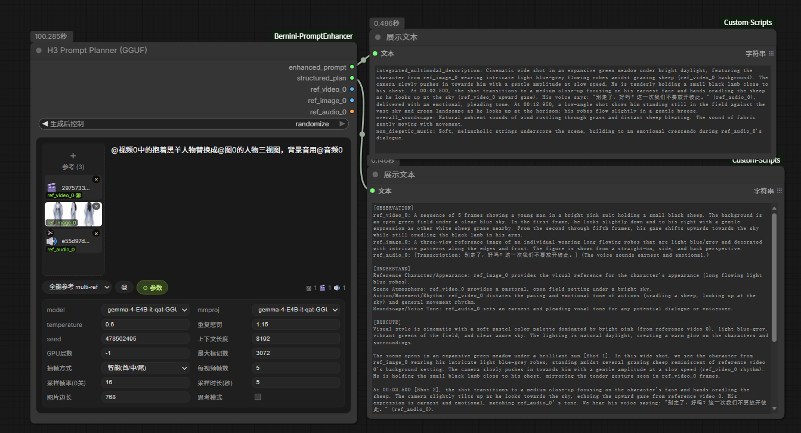

# ComfyUI-Bernini-PromptEnhancer

[English](README.md) | [安装教程](INSTALL.md) | [使用教程](TUTORIAL.zh-CN.md)

ComfyUI 本地提示词增强节点包，基于 GGUF 多模态模型。包含 Bernini VLLM 语义规划、Qwen3.5 文本增强、以及 MiniMax H3 视频提示词规划（Gemma 4 E4B 驱动）——支持多素材上下文分析。零云 API。

## 核心特性

- **13+n 种任务类型** — 13 种核心任务 + 专用轻量任务
- **智能选帧** — `smart_frames` 开关用帧间差异采样替代均匀抽取，给模型更高信息密度
- **首尾帧过渡** — `fl2v` 任务生成从首帧到尾帧的过渡 prompt
- **GGUF 本地推理** — 消费级 GPU，llama.cpp 子进程驱动，无需联网
- **VRAM 零残留** — 子进程隔离，推理后显存完全释放
- **双输出** — `enhanced_prompt` + `structured_plan`
- **图像直通** — `source_video`、`reference_video`、`reference_image_0/1/2` 原样透传
- **双模板模式** — Bernini 节点支持 `structured`（五段规划）和 `official`（单段输出）
- **思考模式开关** — Qwen3.5 节点 `thinking_mode` 开关，默认关闭
- **H3 视频提示词规划** — 多素材上下文（视频+图片+音频），H3 标准三段式输出，直连官方 MiniMax H3 节点

### 任务

| 任务 | 使用的输入 | 说明 |
|------|-----------|------|
| t2v | prompt | 文字生成视频 |
| t2i | prompt | 文字生成图片 |
| v2v | source_video + prompt | 增强/编辑原视频 |
| mv2v | source_video + prompt | 多视频编辑（别名） |
| i2i | prompt | 图片增强 |
| i2v | ref_images + prompt | 图片生成视频 |
| ads2v | source_video + prompt | 视频广告位识别 |
| vi2v | source_video + ref_images + prompt | 视频+参考图编辑 |
| r2v | ref_images + prompt | 参考图生成视频 |
| r2i | ref_images + prompt | 参考图生成图片 |
| rv2v | ref_video + ref_images + prompt | 参考视频+参考图编辑 |
| vrc2v | source_video + ref_images + prompt | 视频+参考图编辑（别名） |
| fl2v | ref_image_0 + ref_image_1 + prompt | 首帧到尾帧过渡描述 |

**专用任务** — 针对特定混合场景，明确各输入的角色分配：

| 任务 | 使用的输入 | 角色分配 | 说明 |
|------|-----------|----------|------|
| r2v_motion | source_video + ref_images + prompt | 参考图=角色, 源视频=动作 | 参考图角色以源视频动作在描述的场景中生成视频 |

所有任务均接受可选的用户 `prompt`，留空时使用默认指令。

**H3 节点任务：** `t2v` / `i2v` / `h3_multi_ref` — 详见下方 [H3 Prompt Planner](#h3-prompt-planner-gguf) 段落。

### 智能选帧

默认从视频等距抽帧。开启 `smart_frames` 后改为缩略图帧差采样：首帧始终保留，剩余名额按帧间变化幅度择优补入。缩略图降采样（64x64）天然抗噪点和压缩伪影。

```
均匀: 30帧视频抽5帧 → 帧 0, 7, 15, 22, 29
智能: 30帧视频抽5帧 → 帧 0（固定）+ 变化最大的4帧
```

通过 `video_frames` 控制抽取数量（1-16）。

### fl2v — 首尾帧过渡

输入 `reference_image_0`（首帧）和 `reference_image_1`（尾帧），生成从首帧到尾帧的连续视频 prompt。图片以 `START-FRAME` 和 `END-FRAME` 标签发送给模型。

## 安装

```bash
cd ComfyUI/custom_nodes
git clone https://github.com/djdzzzz/ComfyUI-Bernini-PromptEnhancer.git
cd ComfyUI-Bernini-PromptEnhancer
pip install -r requirements.txt
```

## 模型准备

下载 GGUF 量化模型到 `ComfyUI/models/clip/`：

- [Bernini-MLLM-Qwen2.5-VL-7B GGUF](https://huggingface.co/mradermacher/Bernini-MLLM-Qwen2.5-VL-7B-GGUF) — 推荐 `Q4_K_M.gguf`
- 同仓库的 `mmproj-*.gguf`

### Qwen3.5 节点（可选）

- [Yusiko/qwen3.5-prompter](https://huggingface.co/Yusiko/qwen3.5-prompter) — Qwen3.5-4B，prompt 工程微调，多模态

### H3 节点

- [Gemma 4 E4B GGUF](https://huggingface.co/unsloth/gemma-4-E4B-it-qat-GGUF) (4.2 GB)；`mmproj-F32.gguf` 在同仓库 — H3 视频提示词规划推荐

## 节点

### Bernini MLLM Prompt Enhancer (GGUF)

**分类：** `Bernini`

| 输入 | 类型 | 默认值 | 说明 |
|------|------|--------|------|
| model | 下拉 | — | .gguf 文件 |
| mmproj | 下拉 | — | .mmproj 文件 |
| task_type | 下拉 | v2v | 13 种任务 |
| template_mode | 下拉 | structured | structured 或 official |
| prompt | STRING | "" | 多行文本 |
| temperature | FLOAT | 0.6 | 0.0–2.0 |
| video_frames | INT | 3 | 每视频抽帧数 1–16 |
| smart_frames | BOOLEAN | false | 帧差智能采样 |
| image_max_side | INT | 512 | 0=原图, 否则最大边长 |
| *source_video* | IMAGE | — | 可选 |
| *reference_video* | IMAGE | — | 可选 |
| *reference_image_0/1/2* | IMAGE | — | 可选 |

| 输出 | 类型 | 说明 |
|------|------|------|
| enhanced_prompt | STRING | 最终 prompt |
| structured_plan | STRING | 规划过程 |
| source_video | IMAGE | 透传 |
| reference_video | IMAGE | 透传 |
| reference_image_0/1/2 | IMAGE | 透传 |

### Qwen3.5 Prompt Enhancer (GGUF)

**分类：** `Bernini`

输入输出与 Bernini 节点一致，额外支持：

| 输入 | 类型 | 默认值 | 说明 |
|------|------|--------|------|
| thinking_mode | BOOLEAN | false | Qwen3.5 思考模式 |

### H3 Prompt Planner (GGUF)

**模型：** Gemma 4 E4B Q4_K_XL (4.2 GB) + mmproj-F32



为 MiniMax H3 提供视频提示词规划。支持视频帧、图片、音频多素材输入，产出 H3 标准三段式英文提示词，包含分镜结构、运镜语法和音效描述。

**任务：** `t2v` / `i2v` / `h3_multi_ref`

**素材：** 拖拽上传，用 `ref_video_1`、`ref_image_1`、`ref_audio_1` 引用。编号与官方 `MiniMax H3 Reference to Video` 节点一致。

**FINAL_PROMPT 格式（H3 标准三段式）：**
```
integrated_multimodal_description: Live-action cinematic...
[Shot 1] ...camera pushes in with small amplitude at slow speed...
At 00:03.500, the camera cuts to... (S1) says: <d>[English]...</d>...

overall_soundscape: 雨水打在石板路上，远处交通低鸣...

non_diegetic_music: N/A
```

**直通连接：** `media_0`–`media_14`（JS 层重命名为 `ref_video_0`、`ref_image_0`、`ref_audio_0`），直接连接官方 `MiniMax H3 Reference to Video` 节点对应输入。

| 输入 | 类型 | 默认值 | 说明 |
|------|------|--------|------|
| model | 下拉 | — | GGUF 文件，自动扫描 |
| mmproj | 下拉 | `<none>` | 视觉投影器（有图片/视频时必选） |
| task_type | 下拉 | `h3_multi_ref` | t2v / i2v / h3_multi_ref |
| prompt | STRING | "" | 多行；用 `ref_video_1` 等引用 |
| temperature | FLOAT | 0.6 | 0.0–2.0 |
| repeat_penalty | FLOAT | 1.15 | 1.0–2.0 |
| seed | INT | 0 | 0 = 随机 |
| n_ctx | INT | 8192 | 上下文窗口 |
| n_gpu_layers | INT | -1 | -1 = 全部 GPU |
| max_tokens | INT | 2048 | 最大输出 token |
| frame_mode | 下拉 | `uniform` | uniform / smart |
| video_frames | INT | 5 | 1–64，每视频抽帧数 |
| sample_fps | INT | 0 | 0 = 使用 video_frames |
| sample_seconds | FLOAT | 5.0 | 采样时长上限 |
| image_max_side | INT | 512 | 64–4096 |
| thinking_mode | BOOLEAN | false | Qwen3.5 思考模式 |

| 输出 | 类型 | 说明 |
|------|------|------|
| enhanced_prompt | STRING | H3 标准三段式提示词（仅 FINAL_PROMPT 段） |
| structured_plan | STRING | OBSERVATION–PRESERVE 规划过程 |
| media_0–14 | IMAGE/AUDIO | 素材透传（JS 层重命名为 ref_video_N 等） |

## 模型

| 量化 | 大小 | 显存 |
|------|------|------|
| Q4_K_M | ~4GB | ~5GB |
| Q8_0 | ~8GB | ~9GB |
| bf16 | ~14GB | ~14GB |

## 致谢

- [Bernini-Diffusers](https://huggingface.co/ByteDance/Bernini-Diffusers) — 语义规划器
- [Bernini MLLM GGUF](https://huggingface.co/mradermacher/Bernini-MLLM-Qwen2.5-VL-7B-GGUF) — GGUF 量化
- [MiniMax H3](https://www.minimax.io/blog/minimax-h3) — 全模态视频生成模型（[开源权重](https://huggingface.co/MiniMaxAI/MiniMax-H3)）
- [Gemma 4 E4B GGUF](https://huggingface.co/unsloth/gemma-4-E4B-it-qat-GGUF) — H3 规划器底座
- [ComfyUI](https://github.com/comfyanonymous/ComfyUI)
- [llama-cpp-python](https://github.com/abetlen/llama-cpp-python)
